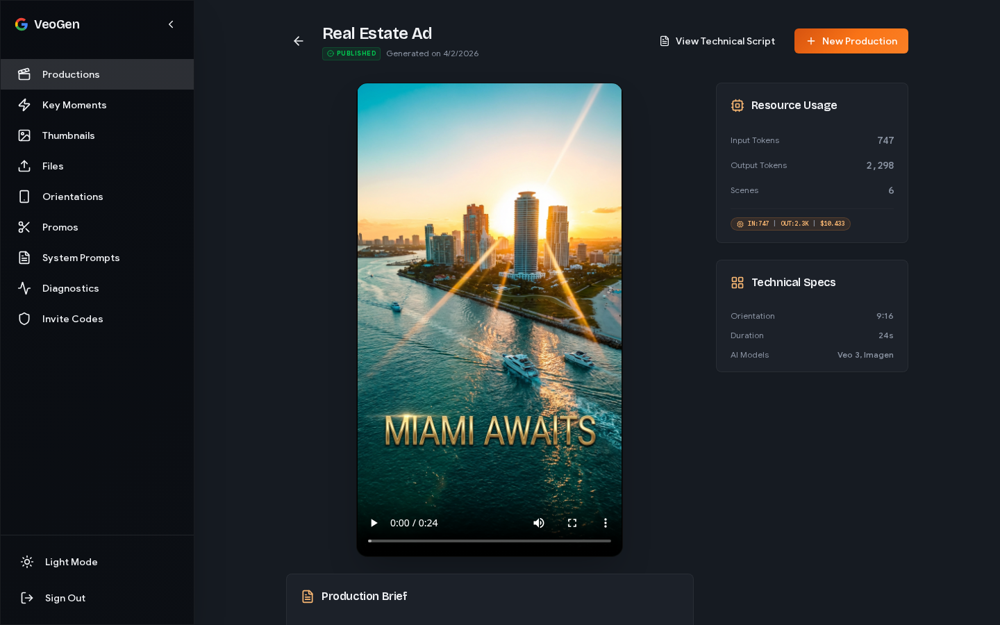
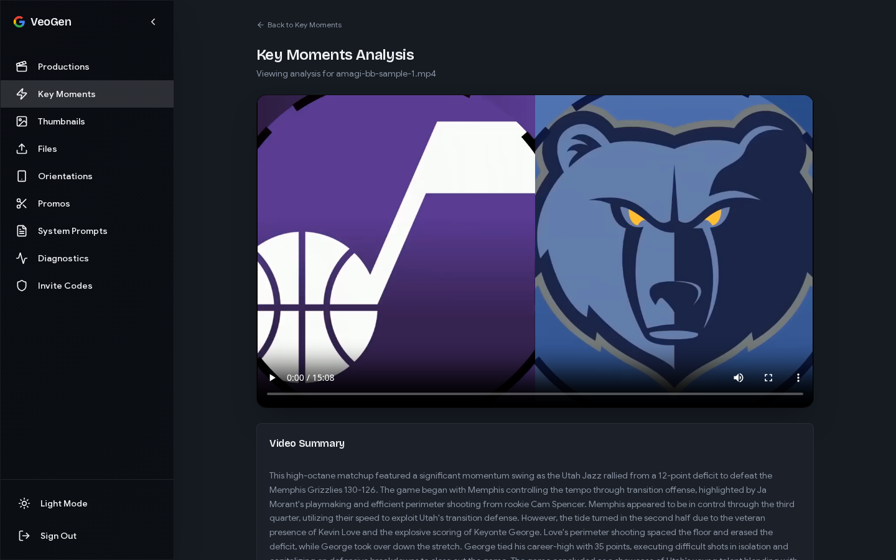

# VeoGen

AI-powered video production platform built on Google Veo and Gemini.

> **Problem:** Creating professional video ads requires expensive tools, specialized skills, and hours of manual editing.
> **Solution:** VeoGen automates the entire pipeline — from script to final cut — using AI models for generation, reframing, and compositing.

> **Architecture:** FastAPI backend orchestrates Gemini (script/storyboard) and Veo (video generation) on Cloud Run, with a React frontend and Firestore for state. A dedicated worker service handles long-running renders asynchronously via a polling loop.

---

## Productions

Create AI-generated video ads from a text prompt. Choose a production type (Movie, Ad, Promo), describe your concept, configure director style and camera movement, and VeoGen generates a storyboard and renders the final video.

| List | Create | Detail |
|------|--------|--------|
|  |  |  |

---

## Key Moments

Extract highlight clips from existing videos. Upload a video and Gemini analyzes it to identify the most impactful moments, returning timestamped segments with a video summary.

| List | Create | Detail |
|------|--------|--------|
|  |  |  |

---

## Thumbnails

Generate eye-catching thumbnails for your videos. Gemini's image model creates multiple thumbnail options from a video or prompt, so you can pick the best one without opening a design tool.

| List | Create | Detail |
|------|--------|--------|
|  |  |  |

---

## Files

Upload and manage source videos and assets. Drag-and-drop files that can be used across productions, key moments, orientations, and promos. The detail view shows file metadata and an inline video player.

| List | Detail |
|------|--------|
|  |  |

---

## Orientations

Reframe videos for different aspect ratios (16:9, 9:16, 1:1). The reframer intelligently crops and repositions content so a landscape ad works on Stories or Reels without manual re-editing.

| List | Create | Detail |
|------|--------|--------|
|  |  |  |

---

## Promos

Stitch together clips into short promotional videos. Select source videos, define the cut order and length, and VeoGen assembles a final promo with title cards and parallel FFmpeg encoding.

| List | Create | Detail |
|------|--------|--------|
|  |  |  |

---

## System Prompts

View and manage the AI prompt templates that drive each generation step. Master users can create and edit prompts; regular users can browse them to understand how the AI is instructed.

| List | Detail |
|------|--------|
|  |  |
