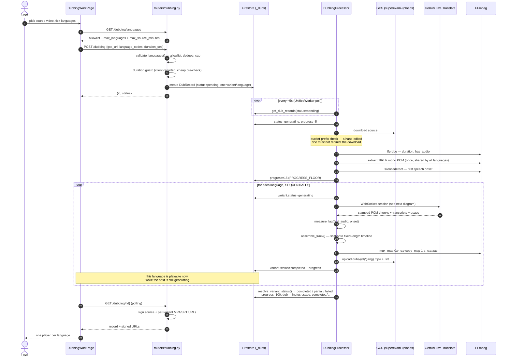
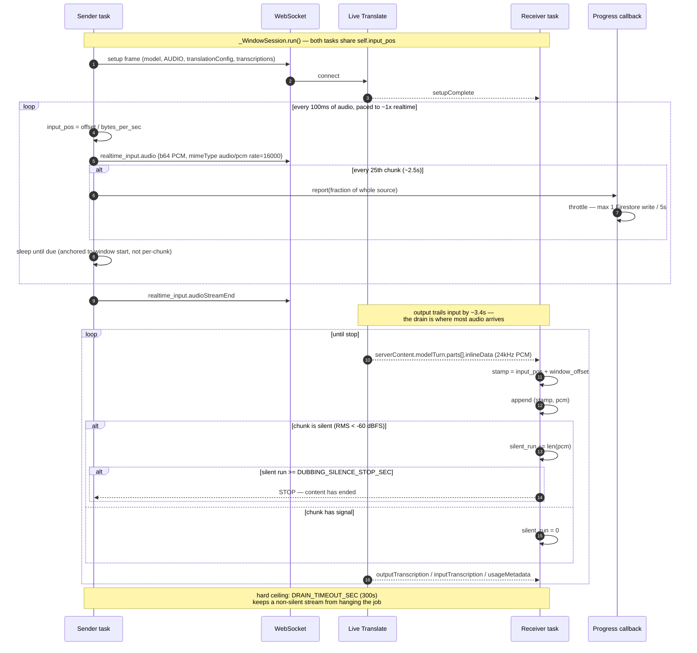

# Multi-Language Dubbing Architecture

## Why does this exist?

A finished video reaches one language's audience. Localizing it traditionally means a
transcript, a translation pass, a voice actor, a studio session, and a re-edit to fit the
new audio under the original picture — days of work per language, repeated per language.

The usual automated shortcut is a three-stage chain: speech-to-text → translate the text →
text-to-speech. It works, but it throws away everything that isn't words. The output is a
flat synthetic read: the speaker's pacing, emphasis, and emotion are gone, and the timing
has to be re-derived from scratch because the TTS track has no relationship to the original.

This pipeline uses **`gemini-3.5-live-translate-preview`** instead — a speech-to-speech
simultaneous interpreter. Source audio streams in, translated audio streams out, with the
speaker's intonation and pacing carried across. There is no text bottleneck in the middle.

The cost of that choice is the thing the rest of this document is about: a simultaneous
interpreter is a *live* model, not a batch one. It runs at conversation speed, it lags
behind its input the way a human interpreter does, and it has no concept of "the file is
finished." Most of the engineering here is turning a real-time stream into a file that
lines up with a video.

**In:** one uploaded video. **Out:** one dubbed MP4 per target language, each with a
translated transcript and an SRT, muxed over the untouched original picture.

---

## Pipeline overview

```
                    ┌──────────────────────────────────────────────────────┐
                    │                     FRONTEND                         │
                    │  DubbingWorkPage ──POST /dubbing──▶ DubRecord        │
                    │  (pick source, tick languages)          (pending)    │
                    └────────────────────────┬─────────────────────────────┘
                                             │  Firestore-as-queue
                                             ▼
┌─────────────────────────────────────────────────────────────────────────────────────┐
│                          WORKER  (dubbing_processor.py)                             │
│                                                                                     │
│   ┌───────────────┐   ┌────────────────────┐   ┌──────────────────────┐             │
│   │ 1. Download   │──▶│ 2. Extract PCM     │──▶│ 3. Speech onset      │             │
│   │    & probe    │   │    16kHz mono s16le│   │    (silencedetect)   │             │
│   │    ffprobe    │   │    ONCE, shared    │   │    = the lag anchor  │             │
│   └───────────────┘   └────────────────────┘   └──────────┬───────────┘             │
│                                                            │                        │
│         ┌──────────────────────────────────────────────────┘                        │
│         ▼                                                                           │
│   ┌─────────────────────────────────────────────────────────────────┐               │
│   │  4. FOR EACH LANGUAGE, IN SEQUENCE  (es → pt → de → hi)         │               │
│   │                                                                 │               │
│   │     ┌──────────────────┐   ┌───────────────────┐                │               │
│   │     │ 4a. Live session │──▶│ 4b. assemble_track│                │               │
│   │     │  WebSocket, 1x   │   │  lag shift onto a │                │               │
│   │     │  paced, silence- │   │  fixed-length     │                │               │
│   │     │  stop drain      │   │  timeline         │                │               │
│   │     └──────────────────┘   └─────────┬─────────┘                │               │
│   │                                      ▼                          │               │
│   │     ┌──────────────────┐   ┌───────────────────┐                │               │
│   │     │ 4d. Upload MP4   │◀──│ 4c. FFmpeg mux    │                │               │
│   │     │     + SRT        │   │  -c:v copy        │                │               │
│   │     └────────┬─────────┘   └───────────────────┘                │               │
│   │              │                                                  │               │
│   │              └──▶ write variant to Firestore — playable NOW     │               │
│   └─────────────────────────────────────────────────────────────────┘               │
│                                        │                                            │
│                                        ▼                                            │
│                        ┌─────────────────────────────────┐                          │
│                        │  5. Roll up status + usage      │                          │
│                        │  completed / partial / failed   │                          │
│                        └─────────────────────────────────┘                          │
└─────────────────────────────────────────────────────────────────────────────────────┘
                                             │
                                             ▼
                    ┌──────────────────────────────────────────────────────┐
                    │  Polls GET /dubbing/{id} ──▶ DubbingResults          │
                    │  one player per language, transcript, SRT download   │
                    └──────────────────────────────────────────────────────┘
```

---

## Sequence: a dubbing job end to end



---

## Sequence: inside one Live session window

The session is the part that isn't like any other job in this codebase. Sender and receiver
run **concurrently on one socket**, and the only thing linking them is `input_pos` — the
source position the sender has reached, which the receiver reads to stamp whatever arrives.
That shared clock is what makes the lag measurable later.



**Why the silence stop exists.** The model never sends `turnComplete`, `generationComplete`,
or any completion flag. Once it has finished translating it streams digital-silence
keep-alive audio indefinitely. An unbounded first read returned **87 seconds of audio for a
30-second clip** — seconds 30 through 87 were pure −99 dBFS. A sustained silent run is not a
heuristic chosen for convenience; it is the only end-of-content signal the protocol offers.

---

## Module map

Six modules, each with one job, so the parts that need credentials, a subprocess, or a
network are separable from the parts that don't.

| File | Responsibility | Needs |
|---|---|---|
| `api/dubbing_config.py` | The single place every `DUBBING_*` env var is read | — |
| `api/dubbing_timeline.py` | Pure functions: lag, track assembly, silence test, SRT | — |
| `api/dubbing_audio.py` | Every ffmpeg/ffprobe call the feature makes | ffmpeg |
| `api/dubbing_live.py` | The only module that talks to the Live API | network + key |
| `api/dubbing_service.py` | One language end to end: translate → assemble → mux → upload | all of the above |
| `workers/dubbing_processor.py` | Job lifecycle, sequencing, progress, status rollup | Firestore |
| `api/routers/dubbing.py` | HTTP surface: validation, CRUD, signing | Firestore |

`dubbing_timeline.py` holding all the algorithmic content and none of the I/O is what makes
the maths unit-testable without credentials — and it is why segment-aligned fitting could
replace `assemble_track` later without the worker knowing.

---

## Why each step matters

### 1. Download and probe

`ffprobe` supplies the authoritative duration and answers `has_audio`. A video with no audio
track fails here with a readable message rather than producing four silent MP4s.

The `source_gcs_uri` is checked against `gs://{bucket}/` before the download. That URI
reaches the worker through Firestore, so the check is what stops a hand-edited document from
pointing the downloader at another bucket.

### 2. Extract PCM once

Live Translate wants 16 kHz mono s16le. `diarization_service.extract_audio()` already
produces exactly that, so this reuses it and unwraps the WAV container rather than shipping a
second extractor.

The unwrap reads frames through Python's `wave` module instead of slicing off a fixed 44-byte
header. ffmpeg sometimes emits extra `LIST`/`INFO` chunks; a fixed slice would prepend
metadata bytes to the audio and desync every stamp downstream by a few milliseconds — a bug
that would look like a mysterious sync error, not a parsing error.

Extraction happens once and the buffer is shared across all languages. There is no reason to
decode the same audio four times.

### 3. Speech onset — the anchor

`silencedetect` finds the source time of the first non-silent audio. This is the *source-side*
anchor: lag is the gap between the first thing said and the first thing translated, and both
positions must be on the same timeline for the subtraction to mean anything.

Only *leading* silence counts. If the audio starts loud, or detection fails, the answer is
`0.0` — "assume speech starts at the top" is the safe default in both cases.

### 4a. The Live session

Covered by the sequence diagram above. Three design points worth calling out:

**Raw WebSocket, not the SDK.** `types.TranslationConfig` requires `google-genai >= 2.8`,
but `google-adk` pins `google-genai < 2` — upgrading would break the ADK agents behind "Ask
Aanya". The frame shapes in `dubbing_live.py` were extracted from google-genai 2.14's
converters, so this sends exactly what the SDK would have sent. `routers/avatars_live.py`
already drives a Live socket the same way, so the pattern isn't novel here.

**Pacing is anchored, not incremental.** Each chunk's send time is computed from the window
start (`started + input_pos / rate`), not by sleeping a fixed interval per chunk. Over the
~600 seconds of a full window, per-chunk sleep error would accumulate into real drift.

**Stamps track input consumed, not wall clock.** `stamp = input_pos + window_offset` stays
correct under network jitter, GC pauses, and a slow Firestore write, all of which would
corrupt a wall-clock stamp.

**Windows.** Live sessions cap at 15 minutes audio-only, so sources longer than
`DUBBING_WINDOW_SEC` (600 s) are split into consecutive windows, one session each, with the
window offset folded into every stamp. Windows run in sequence — they are consecutive slices
of one conversation and the model is a stateful interpreter, so overlapping them would
interleave two positions of the same dialogue. Splitting is index arithmetic on the existing
buffer: no re-encode, and boundaries are frame-aligned so a window can never start mid-sample.

### 4b. Timeline assembly — the algorithmic core

Two problems at once: the stream lags, and it is a pile of stamped fragments rather than a
track.

```
measure_lag(first_output_sec, speech_onset_sec) = max(0, first_output - onset)
```

Clamped at zero. An output that appears to precede the speech that caused it means the onset
probe was fooled — music under the intro, say — and shifting right would only make it worse.

`assemble_track` then lays the chunks down:

- **Preallocate** one `bytearray` of exactly `duration_sec × 24000 × 2` bytes, zero-filled
  (which *is* PCM silence). `buf += chunk` would reallocate and recopy on every one of
  thousands of chunks — quadratic for no reason.
- **Monotonic write cursor**: each chunk starts at `max(want, cursor)`. This makes placement
  total rather than destructive — when the interpreter emits faster than the stamps advance
  (the common case, since stamps only move when the sender feeds more input), chunks append
  instead of overwriting each other, so no speech is truncated.
- **Frame-aligned** offsets (`int(...) * frame`), so a shift can never split a 16-bit sample
  and turn the remainder of the track into noise.
- **Exact length.** The returned buffer is precisely the video's duration. Trailing audio
  that would run past the picture is dropped rather than extending the track. This is what
  makes A/V drift structurally impossible instead of merely unlikely.

Single pass, O(total bytes), and no sort — the receiver appends in arrival order, which is
already non-decreasing.

### 4c. Mux

One pass, video stream-copied: `-map 0:v -map 1:a -c:v copy -c:a aac -shortest
-movflags +faststart`. The picture is never re-encoded, so this is fast and lossless.
`-shortest` is belt-and-braces — `assemble_track` already guarantees the length.

### 4d. Publish, then persist

Each language's MP4 and SRT upload to `dubs/{record_id}/{lang}.{mp4,srt}`, and the variant is
written to Firestore immediately. Paths are built from the server-generated record id plus a
language code re-validated against the allowlist inside `output_blob_paths` — never from a
client-supplied filename, so neither component can walk out of the `dubs/` prefix.

### 5. Rollup

`resolve_variant_status` — shared with adapts so the two features cannot disagree about what
a half-failed job is called. All completed → `completed`, all failed → `failed`, anything
else → `partial`. Anything still `pending` counts as partial, never completed: a job that
stopped early must not look finished.

`dub_minutes` is recorded as a fact (`duration × completed languages`), consistent with the
pricing engine's store-facts-derive-money rule. Live Translate preview pricing is unpublished,
so the record carries `pricing_confidence="low"` and `/pricing/usage` recomputes from the fact
against whatever rate is current — correcting the rate later needs no backfill.

---

## Two decisions worth understanding

### Languages run sequentially — on purpose

The first implementation used `asyncio.gather` over four sockets. It was roughly 4× faster in
wall clock and it was worse to use.

Because all four sessions paced at the same ~1× rate over the same source, they finished
within about a second of each other, at the very end. The record sat untouched for the entire
job, nothing was watchable until everything was, and the UI showed a progress bar parked at
15% for minutes. Fast and opaque lost to slower and legible.

Sequential costs N passes over the source and buys **incremental delivery**: each dub is
uploaded, persisted, and playable the moment it is done, and progress reflects real position
in the work. `DUBBING_CONCURRENCY` — dubbing K languages at a time — is the obvious middle
ground if throughput ever matters more than first-result latency.

### Progress is reported from inside the send loop

Streaming is nearly all of a language's wall clock, so nothing else is an honest progress
signal. But the callback fires from the send loop, and a Firestore round-trip there stalls the
socket it is describing. Two throttles keep that safe:

- report every 25th chunk (~2.5 s of audio), not every 100 ms chunk;
- write at most one Firestore update every `PROGRESS_WRITE_INTERVAL_SEC` (5 s).

The reported fraction is of the **whole source**, not the current window, so progress stays
monotonic across window boundaries. `_write_progress` maps
`(language index + fraction within it) / total languages` onto the **15–95%** band, leaving
0–15% for download/extract/probe and 95–100% for the final write.

---

## Data model

`_dubs` collection, the same one-input-many-outputs shape as `_adapts`.

```python
# Derived from _DUB_LANGUAGE_TABLE — see "Target languages are code, not config".
DUB_LANGUAGES = {"en": "English", "es": "Spanish", "pt-BR": "Portuguese (Brazil)", ...}

class DubVariant:
    language_code: str          # BCP-47, always a key of DUB_LANGUAGES
    status: str                 # pending | generating | completed | failed
    output_gcs_uri: str | None  # dubbed MP4
    srt_gcs_uri: str | None
    translated_transcript: str
    lag_sec: float              # the measured interpreter lag actually applied
    error_message: str | None

class DubRecord:
    id: str                     # "dub-" prefix
    source_gcs_uri: str
    source_transcript: str      # original language, from inputAudioTranscription
    duration_sec: float
    variants: list[DubVariant]
    status: str                 # pending | generating | completed | partial | failed
    progress_pct: int
    usage: UsageMetrics         # dub_minutes
    ...                         # archived, invite_code, createdAt, completedAt
```

`lag_sec` is persisted per variant because it is the one number that explains a sync
complaint. If a dub feels late, that field says whether the shift was measured correctly.

---

## Configuration

All read through `dubbing_config.py`, per call rather than cached at import — the worker is a
long-lived process, and a Cloud Run env change should take effect on the next revision without
a code change.

| Key | Default | Why it exists |
|---|---|---|
| `GEMINI_API_KEY` | — | **Developer API key.** Live Translate is not on Vertex. |
| `DUBBING_LIVE_MODEL` | `gemini-3.5-live-translate-preview` | |
| `DUBBING_LIVE_SURFACE` | `developer` | `vertex` switch for when the model lands there |
| `DUBBING_WINDOW_SEC` | `600` | Under the 15-min session cap, with drain headroom |
| `DUBBING_PACE` | `1.0` | 2.0 works but pushes lag from ~3.4 s to ~4.7 s |
| `DUBBING_SILENCE_STOP_SEC` | `4.0` | End-of-content detection |
| `DUBBING_SILENCE_FLOOR_DB` | `-60.0` | Silence threshold, dBFS |
| `DUBBING_MAX_SOURCE_MINUTES` | `30` | Resource guard (see below) |
| `DUBBING_MAX_LANGUAGES` | `4` | Fan-out cap |

### Target languages are code, not config

The language table lives in `api/models_records.py` as `_DUB_LANGUAGE_TABLE`, with
`DUB_LANGUAGES` (code → name) and `DUB_LANGUAGE_REGIONS` (code → group) derived from it so the
two cannot drift. `supported_languages()` is the accessor the router and worker share.

It is deliberately *not* an env var. These codes are the model's contract, not a preference:
an env var could only narrow the list correctly or break it, and a typo'd code would surface
as a failed job mid-dub rather than as a startup error. Adding a language is a one-line code
change plus a test, which is the right amount of ceremony for something that has to match an
upstream table.

| Group | Languages |
|---|---|
| English | English (`en`) |
| European | Spanish (`es`), Portuguese — Brazil (`pt-BR`), Portuguese — Portugal (`pt-PT`), German (`de`), French (`fr`) |
| Indian | Hindi (`hi`), Bengali (`bn`), Tamil (`ta`), Telugu (`te`), Kannada (`kn`), Malayalam (`ml`) |

Two codes are not what you would guess, and both come straight from the model's published
supported-languages table:

- **English has no regional variants.** The model accepts `en` and nothing else — there is no
  `en-US`, `en-GB`, or `en-IN`, so British/American/Indian English is not a choice this
  feature can offer. The picker says so rather than leaving users hunting for it.
- **Portuguese has no bare `pt`.** Only `pt-BR` and `pt-PT` are published, so both are listed
  as separate targets. (An earlier version of this feature sent bare `pt`; the API tolerated
  it, but it was never a documented code.)

Region labels are presentation only — they group the picker and never take part in
validation. The table's order is the display order, so the endpoint returns it unsorted and
the UI groups on runs of equal region.

---

## Security notes

- **A01 Access control** — POST/PATCH/DELETE gated by `validate_invite_code`; `source_gcs_uri`
  is verified to be inside this service's bucket before download.
- **A02 Secrets** — `GEMINI_API_KEY` is read from env at call time, never returned by an
  endpoint, never written to Firestore, never logged. *Currently a plain env var on the worker
  with a `TODO` for Secret Manager — the deploying identity lacks `secretmanager` access.*
- **A03 Injection** — language codes hit the allowlist at the router, before they can reach a
  GCS path or an API field; GCS destinations come from the server-generated record id;
  all ffmpeg arguments go through `ffmpeg_runner` as an argv list, never a shell string.
- **A04 Resource exhaustion** — the worker is single-instance, single-job, so a long source
  blocks every other job for its whole duration. `DUBBING_MAX_SOURCE_MINUTES` is checked
  cheaply at the router against the client-reported duration and again in the worker against
  the real `ffprobe` duration, which is the authority.
- **A09 Logging** — every failure lands on `error_message` *and* in the worker log under the
  `[dub:{id}:{lang}]` tag. Transcript bodies are never logged at INFO: they are the user's
  speech.

---

## Failure behavior

| Failure | Result |
|---|---|
| One language fails | That variant is `failed` with its reason; the others continue. Record rolls up `partial`. `dub_language` never raises. |
| Source has no audio | Job fails fast with a readable message, before any session opens. |
| Source too long | 400 at the router; re-checked in the worker against the real duration. |
| Model streams non-silent noise forever | `DRAIN_TIMEOUT_SEC` (300 s) cuts the drain and uses what arrived. |
| No audio returned at all | `failed` variant: "Live Translate returned no audio". |
| No transcript fragments | MP4 still publishes; SRT is skipped with a warning. |
| Retry | `_dub_retry_updates` resets only non-completed variants — completed languages keep their output rather than being re-dubbed at full cost. |

---

## Testing

`api/tests/test_dubbing.py` — 51 tests, no network, no credentials.

- `assemble_track` — chunk lands at the right byte; lag shifts it earlier; overlapping chunks
  append rather than truncate; length is exactly `duration × rate × width`; a stamp earlier
  than the lag clamps to 0; offsets stay sample-aligned.
- `build_srt` — timecode formatting, lag shift, and `test_cues_never_overlap`, which is the
  regression that motivated the group-then-render rewrite.
- `measure_lag`, `is_silent`, `resolve_variant_status`, the 15–95% progress mapping, router
  validation (unknown code → 400, over-cap → 400), and `_dub_retry_updates`.

`api/tests/test_route_shadowing.py` is structural rather than dubbing-specific: it walks
`app.routes` and asserts no literal path is registered after a `/{param}` route that would
swallow it. `GET /dubbing/languages` hit exactly that bug during development — and the scan
found `/adapts/presets` had been silently broken in production the same way, with the frontend
`.catch` rendering "no presets" instead of an error.

---

## Known limits

- **Preview model, non-Vertex surface.** The feature depends on one preview model reachable
  only by API key. `DUBBING_LIVE_SURFACE` keeps the migration cheap; if the model is
  withdrawn, the fallback is transcribe → translate → TTS, for which the repo already has
  Chirp 3 diarization.
- **Residual sync drift.** A global lag shift corrects the constant offset, not per-utterance
  drift — expect a second or two of slip on long takes. `assemble_track` is isolated
  precisely so segment-aligned fitting can replace it.
- **Voice consistency across windows.** Documented model behavior: voice replication drifts
  after long pauses. Window boundaries are the likeliest place to hear a shift.
- **Wall-clock occupancy.** 1× pacing × N languages means a 10-minute video in four languages
  holds the single worker for roughly 40 minutes, blocking every other job.
  `DUBBING_MAX_SOURCE_MINUTES` bounds the damage; a dedicated worker service is the answer if
  dubbing gets real usage.
- **Language detection** struggles with heavy accents, per the model's documentation.
